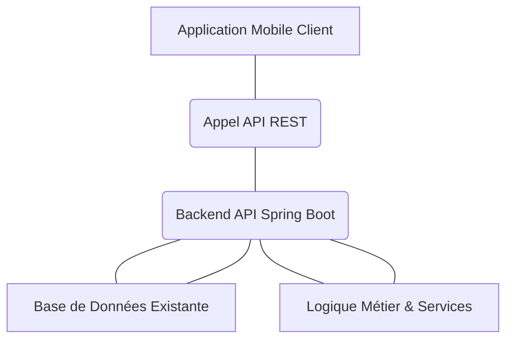

# Vision et Architecture de l'Application Mobile pour la Boutique de Pagne et Tissus

## 1. Introduction

L'objectif de cette application mobile est d'étendre la portée de votre boutique en offrant aux clients une plateforme moderne et accessible pour découvrir vos produits (pagne et tissus de qualité), les consulter en détail, et passer des commandes. Cette application s'intégrera nativement à votre système de gestion de stock existant, assurant ainsi une cohérence parfaite des données et une gestion simplifiée.

## 2. Intégration avec l'Application de Gestion de Stock Existante

Votre application Spring Boot actuelle, qui gère le stock, servira de **backend API** central.
*   **Développement d'Endpoints RESTful :** Des points d'accès API (endpoints) sécurisés seront créés dans votre application Spring Boot. Ces APIs permettront à l'application mobile de :
    *   Récupérer la liste des produits (avec images, descriptions, prix, disponibilité).
    *   Rechercher des produits spécifiques.
    *   Créer et gérer les commandes passées par les clients.
    *   Potentiellement gérer l'authentification et les profils clients.
*   **Communication :** L'application mobile communiquera exclusivement avec ces APIs pour toutes les interactions nécessitant des données du backend ou des actions sur celui-ci (comme passer une commande ou vérifier le stock).

## 3. Fonctionnalités Clés de l'Application Mobile

L'application mobile mettra l'accent sur l'expérience utilisateur et la qualité de la présentation des produits.

### a. Parcours Produit

*   **Catalogue Intuitif :** Navigation aisée à travers les catégories de produits, avec des options de recherche et de filtrage pour aider les clients à trouver rapidement ce qu'ils désirent.
*   **Détails Produit Enrichis :** Pour chaque pagne ou tissu, affichage clair du nom, de la description (composition, origine, usages), du prix, et surtout, d'une **galerie d'images multiples et en haute résolution**. La possibilité de zoomer sur les images sera cruciale pour mettre en valeur la qualité et les motifs des tissus.
*   **Disponibilité en Stock :** Indication en temps réel de la disponibilité du produit.

### b. Panier d'Achat

*   **Gestion Simple :** Les clients pourront ajouter ou retirer des articles de leur panier en toute simplicité.
*   **Visualisation Claire :** Un récapitulatif détaillé du panier permettra de vérifier les articles, les quantités et le prix total avant de procéder à la commande.

### c. Processus de Commande

*   **Tunnel de Commande Guidé :** Un processus de commande clair et sécurisé, demandant les informations nécessaires (coordonnées, adresse de livraison, etc.).
*   **Options de Paiement :** Intégration de méthodes de paiement (à définir selon vos besoins : mobile money, carte bancaire, paiement à la livraison, etc.).
*   **Historique des Commandes :** Les clients auront accès à un historique de leurs commandes passées, avec le statut de chaque commande.

### d. Authentification et Profil Client

*   **Création de Compte et Connexion :** Processus simple et sécurisé pour la création de comptes et la connexion.
*   **Gestion du Profil :** Les clients pourront consulter et modifier leurs informations personnelles, leurs adresses de livraison, et leurs préférences.

### e. Notifications (Évolution Future)

*   **Mises à Jour en Temps Réel :** Possibilité d'intégrer des notifications push pour informer les clients de la confirmation de leur commande, de l'expédition, de l'arrivée de nouveaux produits, ou de promotions spéciales.

## 4. Technologies Proposées

Le choix des technologies est crucial pour assurer performance, maintenabilité et une bonne expérience utilisateur.

### a. Pour l'Application Mobile

Nous recommandons des frameworks multiplateformes pour cibler efficacement les utilisateurs iOS et Android avec une seule base de code, réduisant ainsi les coûts et le temps de développement :

*   **Flutter (avec le langage Dart) :** Reconnu pour ses performances quasi-natives, son rendu visuel riche et sa productivité élevée. Excellent pour des applications axées sur une UI/UX personnalisée et fluide.
*   **React Native (avec JavaScript/TypeScript) :** Très populaire, il permet aux développeurs web de réutiliser leurs compétences. Offre une grande flexibilité et un vaste écosystème.

### b. Pour l'API Backend (Votre application de gestion de stock existante)

*   **Spring Boot (Java) :** Votre backend actuel est déjà basé sur Spring Boot, ce qui est une excellente base. Il sera nécessaire d'ajouter de nouveaux contrôleurs (`@RestController`) pour exposer les données et fonctionnalités requises par l'application mobile.
*   **Sécurité API :** La mise en place d'un mécanisme d'authentification et d'autorisation robuste (par exemple, des Tokens Web JSON - JWT, ou OAuth2) sera indispensable pour sécuriser l'accès aux APIs depuis l'application mobile.

## 5. Architecture Générale

L'architecture sera basée sur une approche client-serveur standard :

*   **Couche Présentation (Application Mobile) :** Gère l'interface utilisateur, la navigation, et l'interaction directe avec le client.
*   **Couche Application (Application Mobile) :** Contient la logique métier spécifique au mobile, gère les appels aux APIs backend et le traitement des données reçues pour l'affichage.
*   **Backend API (Application de Gestion de Stock) :** Fait le lien entre l'application mobile et la base de données. Il expose les données, applique la logique métier côté serveur, et gère la sécurité.
*   **Base de Données (Existante) :** La base de données de votre système de gestion de stock restera la source unique de vérité pour toutes les informations (produits, clients, commandes, stock).

## 6. Étapes Suivantes pour la Réalisation

Pour concrétiser cette vision, les prochaines étapes clés sont :

1.  **Définition Détaillée des APIs REST :** Spécifier précisément chaque endpoint API nécessaire, les formats de requête et de réponse, et les règles de sécurité associées.
2.  **Conception UX/UI de l'Application Mobile :** Créer des maquettes, des prototypes et un design attractif pour l'application, en s'inspirant des couleurs et de l'identité de votre boutique, et en mettant en valeur la beauté des pagnes et tissus.
3.  **Développement Incrémental :** Commencer par un Produit Minimum Viable (MVP) incluant les fonctionnalités les plus essentielles (affichage des produits, détails, ajout au panier) pour obtenir rapidement des retours.
4.  **Tests :** Mettre en place des tests unitaires, d'intégration et fonctionnels pour garantir la qualité et la robustesse de l'application mobile et des APIs.

Ce document sert de base pour la planification de votre projet d'application mobile.
